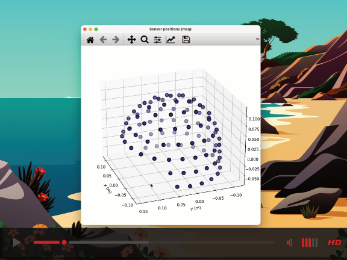
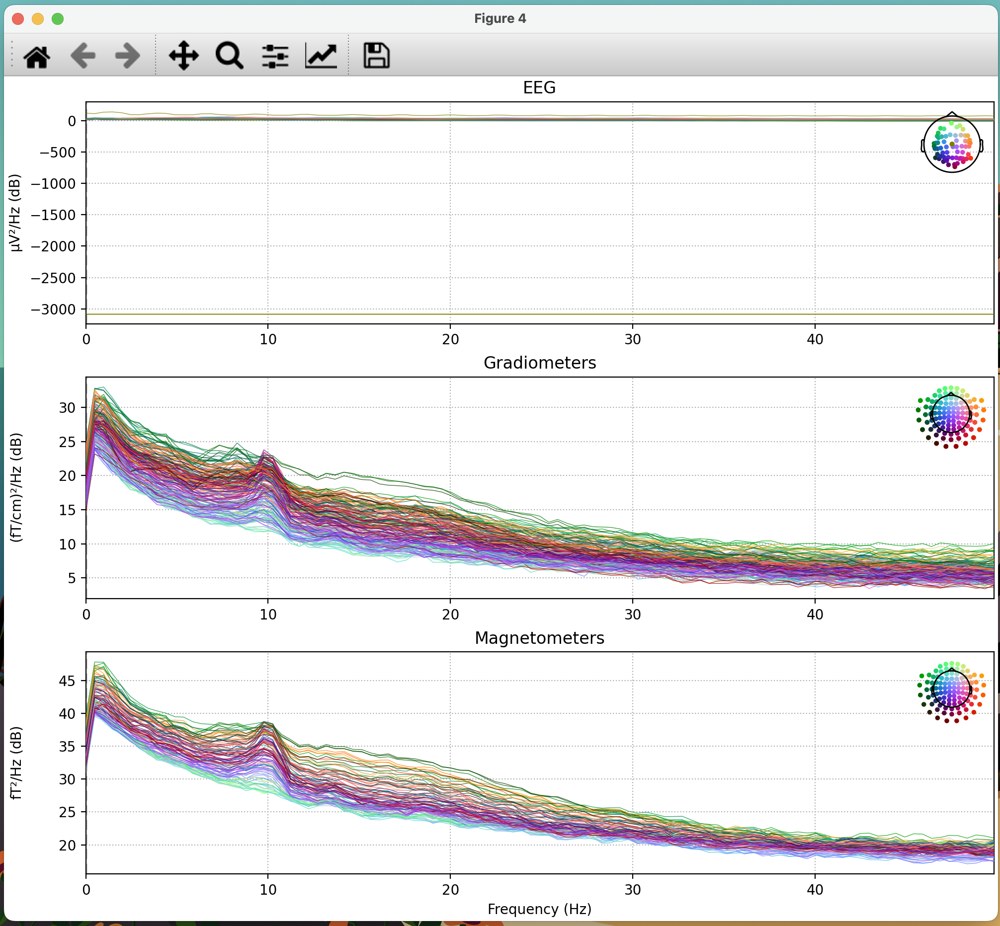
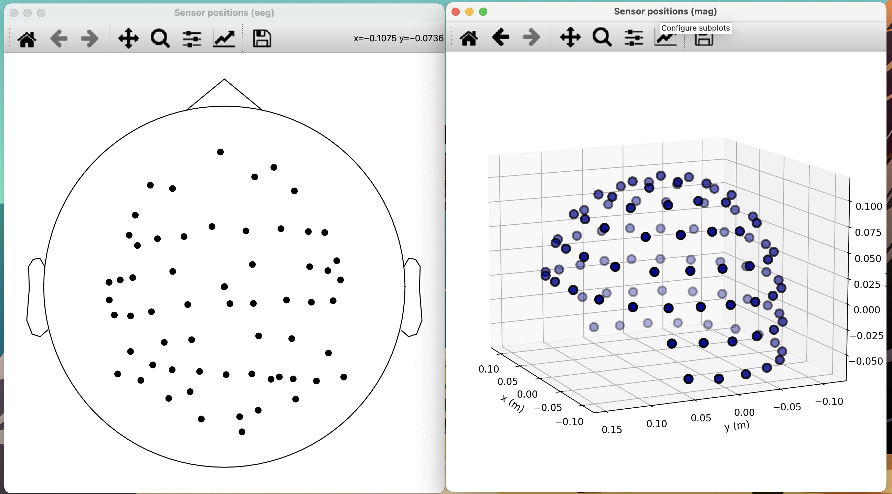

# MEG-Tools
Tools for accessing, visualizing, and analyzing MEG in python.
[](https://www.youtube.com/watch?v=vfZQJUltfMA)
## Requirements
MEG-Tools requires the installation of the MNE library. Visit [mne.tools](https://mne.tools) to download and install. For a great introduction on MNE see [Pybrain: M/EEG analysis with MNE Python](https://www.youtube.com/watch?v=t-twhNqgfSY)

### File Type
Currently the tools support MEG data exported as .mat data from MatLab. If your data is in another format, you mostly likely can load it directly into MNE.

## Using the Tools
1. Download or clone this repository.
2. Copy an MEG file to the directory, such as "case_2225_with_spike_dipoles_sleep_2.mat"
3. Open the MEG-Start Notebook and change the name in `meg = MEG('case_2225_with_spike_dipoles_sleep_2.mat')`
4. Run all the code blocks.
5. You should see something like the following image for `mne_fif.plot(scalings={'mag': 3.0e-11,'eeg': 1.0e-3})`


## Further Examples
The notebook 'MEG-Examples' contains further examples such as:




## Properties of MEG Object
Other than plotting, the MEG object makes the following properties available:
```
        self.data_raw #the actual values from the MEG
        self.fif_data_info #Metadata
        self.sampling_freq 
        self.highpass
        self.lowpass

        self.channels #A list of each channel. Each channel contains the following information:
        ['scanno', 'logno', 'kind', 'range', 'cal', 'coil_type', 'loc', 'coil_trans',
        'eeg_loc', 'coord_frame', 'unit', 'unit_mul', 'ch_name']
```

